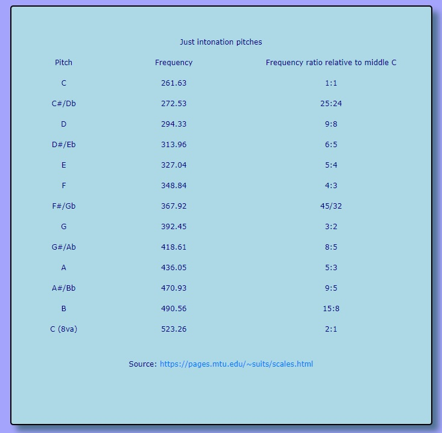

# Tuning and Physics

[Description](#description)

[Licence](#license)

[Installation](#installation)

[Usage](#usage)

[Dependencies](#dependencies)

[Contributing](#contributing)

[GitHub Link](#github-link)

## Description
This page demonstrates the sound of just intonation, equal temperament semiotones, equal temeperament quarter tones, and the overtone series.

### License
GNU General Public Licence

### Installation
N/A

### Usage
Use the keyboard on the bottom on the page to hear notes in just intonation, as opposed to conventional equal temperament.

### Dependencies
N/A

### Contributing
Email Ryan at ryanpburnett@yahoo.com

### GitHub Link
github.com/ryanpburnett

The repo for this readme generator can be found on RPB's [Github](https://github.com/ryanpburnett/readme-generator) page.